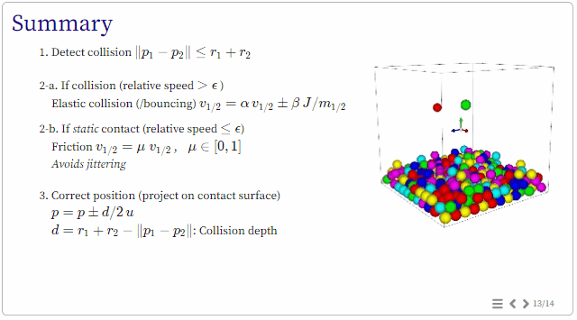

# INF585 Computer Animation - course slides

## Download

```
git clone --recursive https://github.com/drohmer/inf585_course_slides.git
```

## Run

```
python generate.py [--pdf] [--all] [--videos]
```


* --pdf: Generate pdf output as well as one image per slide.

* --all: Generate all directories in src/. Otherwise generates only the directory set in the variable compile_dirs (defined in generate.py).

* --videos: Compute cached videos in multiple formats (.mp4, .webm) for maximal compatibility on various systems (can take a while).


_Slides are generated by default in \_site/ directory_


<p align="center"> 

</p>


## Links

* [INF585 Course Website](https://damienrohmer.com/data/teaching/2022_2023/x-inf585)
* [INF585 Lab class](https://damienrohmer.com/data/teaching/2022_2023/x-inf585/practice/index.html) [ [source slides](https://github.com/drohmer/inf585_code) ] [ [source code](https://github.com/drohmer/inf585_code) ]
* [CGP Library](https://imagecomputing.net/cgp) [ [source](https://github.com/drohmer/cgp) ]